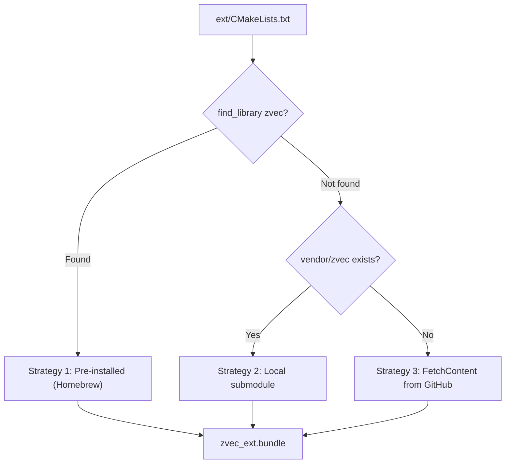
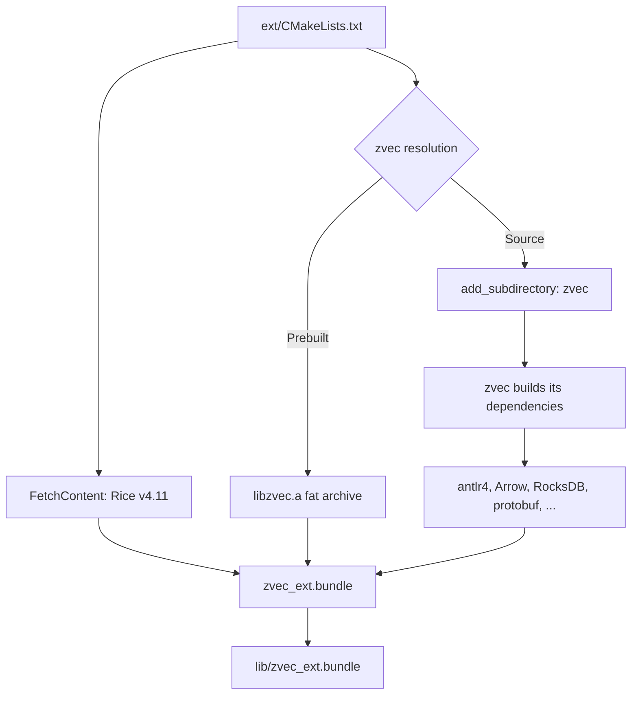

# Build System

The zvec gem uses CMake to build the native extension, rather than the traditional Ruby `extconf.rb` + `mkmf` approach. This is necessary because the zvec C++ library has its own CMake build with many dependencies.

## Why CMake?

The zvec C++ library uses CMake with subdirectory builds for its dependencies (HNSW algorithms, quantizers, parsers, etc.). Wrapping this in `extconf.rb` would require duplicating the entire build configuration. Instead, the gem's `CMakeLists.txt` integrates with zvec's build system directly.

## Three-Tier Resolution

The build uses a three-tier strategy to locate the zvec C++ library:



### Strategy 1: Pre-installed Library (Fast Path)

When zvec is pre-installed via Homebrew (`brew install madbomber/zvec/zvec`), the build finds `libzvec.a` and links against it directly. Only the 8 Rice binding files are compiled (~10 seconds).

```cmake
find_library(ZVEC_LIBRARY zvec HINTS /opt/homebrew/opt/zvec/lib)
find_path(ZVEC_INCLUDE_DIR zvec/db/collection.h HINTS /opt/homebrew/opt/zvec/include)
```

The Homebrew formula produces a **single fat static archive** (`libzvec.a`) that bundles all zvec libraries and vendored thirdparty dependencies (Arrow, RocksDB, protobuf, etc.) into one file via `libtool -static`. This simplifies linking — the gem links one library instead of managing a dependency graph.

### Strategy 2: Local Submodule (Development)

For development checkouts with `--recurse-submodules`, the build uses `vendor/zvec` via `add_subdirectory`. This builds everything from source (~10 minutes) but integrates with CMake targets for IDE support and debugging.

### Strategy 3: FetchContent (Fallback)

For `gem install` without Homebrew, CMake's `FetchContent` downloads zvec from GitHub at a pinned commit and builds from source. This is the slowest path (~10 minutes) but works anywhere with CMake, a C++17 compiler, and ICU4C.

## Build Flow



## Directory Layout

```
ext/
  CMakeLists.txt       # Main build file (three-tier resolution)
  CMakePresets.json     # Build presets (debug/release)
  cmake/               # CMake helper modules (symlink to vendor/zvec/cmake in dev)
  zvec/
    zvec_ext.cpp        # Extension entry point
    zvec_common.hpp     # Shared includes and error handling
    zvec_types.cpp      # Enum bindings
    zvec_status.cpp     # Status and exception hierarchy
    zvec_params.cpp     # Index/query parameter bindings
    zvec_schema.cpp     # FieldSchema and CollectionSchema
    zvec_doc.cpp        # Doc with typed get/set
    zvec_collection.cpp # Collection CRUD operations
    zvec_config.cpp     # Global configuration
```

## Build Presets

Defined in `ext/CMakePresets.json`:

| Preset | Build Type | Flags | Use Case |
|--------|-----------|-------|----------|
| `macos-debug` | Debug | `-g -O0` | Development, lldb debugging |
| `macos-release` | Release | `-O3 -DNDEBUG` | Performance, distribution |

Both presets use the Ninja generator and set `CMAKE_PREFIX_PATH` to `/opt/homebrew/opt/icu4c@78`.

## Dependencies

| Dependency | Method | Purpose |
|-----------|--------|---------|
| [Rice](https://github.com/ruby-rice/rice) v4.11 | CMake FetchContent | C++/Ruby binding layer (header-only) |
| zvec C++ | Homebrew / submodule / FetchContent | Vector database engine |
| ICU4C | System (Homebrew `icu4c@78`) | Unicode support (required by Arrow) |

## Force-Loading Algorithm Libraries

zvec uses self-registering algorithm factories. Static constructors register algorithm implementations with a factory at load time. On macOS, these static libraries must be force-loaded to ensure their registration code runs.

**With pre-installed library (Strategy 1):**

The entire fat archive is force-loaded:

```cmake
target_link_libraries(zvec_ext PRIVATE -Wl,-force_load,${ZVEC_LIBRARY})
```

**With source build (Strategies 2 and 3):**

Each algorithm library is force-loaded individually:

```cmake
foreach(lib ${ZVEC_ALGO_LIBS})
  target_link_libraries(zvec_ext PRIVATE -Wl,-force_load,$<TARGET_FILE:${lib}>)
endforeach()
```

Without `-force_load`, the linker would strip the "unused" registration code and the algorithms would silently fail to register.

## Output

The build outputs `zvec_ext.bundle` to a directory determined by the build context:

```cmake
if(CMAKE_LIBRARY_OUTPUT_DIRECTORY)
  # RubyGems sets this to the gem's extension install directory
  set(_EXT_OUTPUT_DIR "${CMAKE_LIBRARY_OUTPUT_DIRECTORY}")
else()
  # Development builds output to the local lib/ directory
  set(_EXT_OUTPUT_DIR "${CMAKE_CURRENT_SOURCE_DIR}/../lib")
endif()
```

Ruby loads the extension via `require "zvec_ext"` in `lib/zvec.rb`.

## Homebrew Formula

The `Formula/zvec.rb` file contains a Homebrew formula that builds the zvec C++ library from source and installs:

- `include/zvec/` — Public headers
- `lib/libzvec.a` — Fat static archive (~150-200 MB) containing all zvec and thirdparty libraries
- `lib/pkgconfig/zvec.pc` — pkg-config file for discovery

Install with:

```bash
brew tap madbomber/zvec https://github.com/MadBomber/zvec-ruby.git
brew install madbomber/zvec/zvec
```

The formula builds at a pinned commit matching the gem's expected zvec version.
