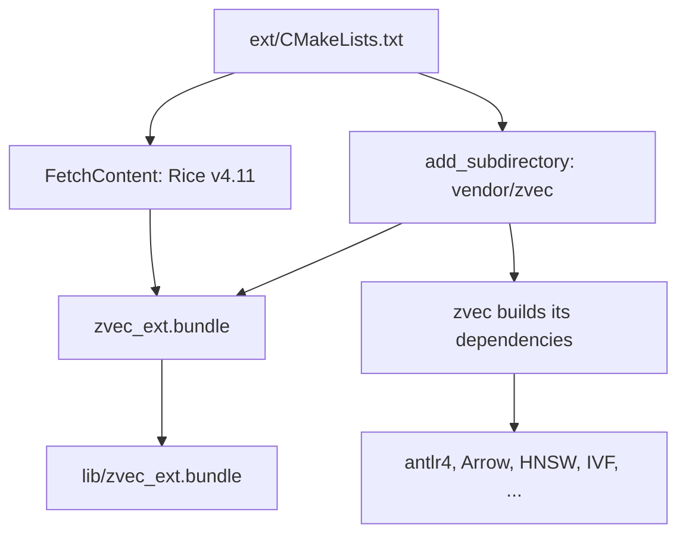

# Build System

The zvec gem uses CMake to build the native extension, rather than the traditional Ruby `extconf.rb` + `mkmf` approach. This is necessary because the zvec C++ library has its own CMake build with many dependencies.

## Why CMake?

The zvec C++ library uses CMake with subdirectory builds for its dependencies (HNSW algorithms, quantizers, parsers, etc.). Wrapping this in `extconf.rb` would require duplicating the entire build configuration. Instead, the gem's `CMakeLists.txt` adds zvec as a CMake subdirectory and links against it.

## Build Flow



## Directory Layout

```
ext/
  CMakeLists.txt       # Main build file
  CMakePresets.json     # Build presets (debug/release)
  cmake/               # CMake helper modules
  zvec/
    zvec_ext.cpp        # Extension entry point
    zvec_common.hpp     # Shared includes and error handling
    zvec_types.cpp      # Enum bindings
    zvec_status.cpp     # Status and exception hierarchy
    zvec_params.cpp     # Index/query parameter bindings
    zvec_schema.cpp     # FieldSchema and CollectionSchema
    zvec_doc.cpp        # Doc with typed get/set
    zvec_collection.cpp # Collection CRUD operations
    zvec_config.cpp     # Global configuration
```

## Build Presets

Defined in `ext/CMakePresets.json`:

| Preset | Build Type | Flags | Use Case |
|--------|-----------|-------|----------|
| `macos-debug` | Debug | `-g -O0` | Development, lldb debugging |
| `macos-release` | Release | `-O3 -DNDEBUG` | Performance, distribution |

Both presets use the Ninja generator and set `CMAKE_PREFIX_PATH` to `/opt/homebrew/opt/icu4c@78`.

## Dependencies

The build pulls in these dependencies automatically:

| Dependency | Method | Purpose |
|-----------|--------|---------|
| [Rice](https://github.com/ruby-rice/rice) v4.11 | CMake FetchContent | C++/Ruby binding layer |
| zvec C++ | Git submodule (`vendor/zvec`) | Vector database engine |
| ICU4C | System (Homebrew) | Unicode support |

Rice is header-only, so no separate library is built — it's compiled directly into the extension.

## Force-Loading Algorithm Libraries

zvec uses self-registering algorithm factories. On macOS, these static libraries must be force-loaded to ensure their registration code runs:

```cmake
foreach(lib ${ZVEC_ALGO_LIBS})
  target_link_libraries(zvec_ext PRIVATE -Wl,-force_load,$<TARGET_FILE:${lib}>)
endforeach()
```

Without `-force_load`, the linker would strip the "unused" registration code and the algorithms would silently fail to register.

## Output

The build outputs `zvec_ext.bundle` directly to the `lib/` directory:

```cmake
set_target_properties(zvec_ext PROPERTIES
  PREFIX ""
  SUFFIX ".bundle"
  LIBRARY_OUTPUT_DIRECTORY "${CMAKE_CURRENT_SOURCE_DIR}/../lib"
)
```

Ruby loads it via `require "zvec_ext"` in `lib/zvec.rb`.
